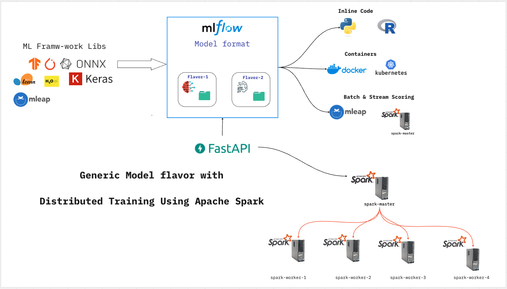

### Custom Apache Spark Cluster run databricks locally



```bash
docker compose up --build
```


### Course Outline
- [1. Getting Start with Pyspark](./jobs/v1_getting_start.ipynb)
- [2. SQL on Pyspark](./jobs/v2_sql_on_spark.ipynb)
- [3. SparkSession for Application](./jobs/v3_sparkSession.ipynb)
- [4. MLflow on Spark](./jobs/v4_mlflow_onspark.ipynb)
- [5. Sklearn model and TF model flavors with MLflow Generic Model ](./jobs/mlflow_model_generic_flavor_1.ipynb)
- [6. Hyperparameter tuning using Spark Cluster ](./jobs/v6_hper_param.ipynb)
- [7. TF tensor input model flavors with MLflow Generic Model](./jobs/mlflow_model_generic_flavor_2.ipynb)
- [8. Distibuted Training With Hyperparameter tuning using Hyperopt and MLflow](./jobs/distibuted_trainingAnd_params_tuning_with_mlflow.ipynb)